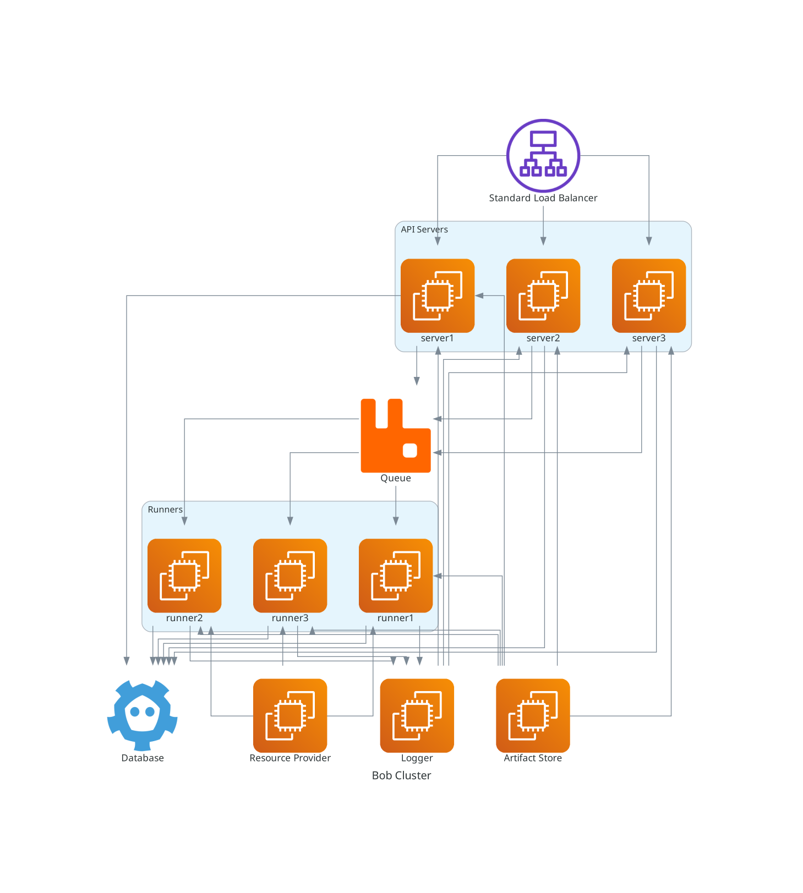

# Bob's Architecture

The following are the tenets of Bob's design:

- Have decentralised, controller/masterless clusters: simplify decision making and network chatter. No centralised decision making.
- Be [spec-first](https://www.atlassian.com/blog/technology/spec-first-api-development) throughout: All the way from the APIServers, CLIs and the whole ecosystem.
- Be externally extensible by decomposition and decoupling: More, smaller, complementing parts are better than one fewer bigger ones.

## Bob Core

Bob follows the UNIX [Philosophy](https://en.wikipedia.org/wiki/Unix_philosophy) of being small, robust and do one thing and do it well.
Unlike most of the popular CI tooling, Bob tries to be a collection of small components which does one thing really well and allows you to compose them in the way you want and build your CI platform.

The core of the project lives in this [repository](https://github.com/bob-cd/bob). Its entirely written in [Clojure](https://clojure.org/), which allows Bob to be really small, scale easily and handle concurrency well. It uses [XTDB](https://xtdb.com/) as its temporal, document database.

All of the internals is exposed via a standard [REST API](api.md).

## Pipeline

A [Pipeline](pipelines.md) is the one and only build unit for Bob. Bob is simple and therefore avoids the need of complex hierarchies (e.g. Jobs). A pipeline is completely self contained and can be linked to other pipelines either in up/downstream.

## Extending Bob and Plugins

Extending should be external, i.e. one should be able to _change Bob’s behavior by calling/using it differently_ without having to dig too deep into the core.

Extension of a CI/CD system is generally needed in the case of making the system interact with the world differently. Examples would be cloning a different kind of source control, reading a file from network, reacting to events etc. For this Bob defines a [Resource](resources.md), its way of abstracting out the need to know _how_ to fetch something.

The other need for extension is to store/deploy the results of a build somewhere. For this Bob defines an [Artifact](artifacts.md), its way of abstracting out the need to know _how_ to publish its build results.

## The Execution Model

Like its depicted in the diagram above, Bob uses [Podman](https://podman.io/) internally as its execution engine. This provides an easily provisioned, isolated and disposable environment for build to take place in. The runners in Bob runners are guaranteed to be **rootless** hence are safe to be run in a cloud native environment. Each runner can execute multiple pipeline runs concurrently fully isolated from each other.

A pipeline is executed in the following way:

- The image provided in the pipeline is pulled in (if already not present).
- A container is created with the command specified in the first step.
- If any environment variables are defined, they are added to the container.
- If the step has defined a `needs_resource` key, the corresponding resource is fetched from the provider and copied over to the container.
- The relevant working directory is set: the resource folder if a resource was mounted or the home of the container.
- The container is started and Bob waits for its completion.
- Bob attaches to the stderr and stdout of the container while its running and streams the log to the DB.
- If the container exits with code as zero and if a `produces_artifact` key was defined in the step, Bob streams the artifact out from the path on the container to the Artifact Store. If the exit was anything other than zero, Bob marks the pipeline run as failed and stops executing the rest of the steps.
- If the last step succeeded, Bob creates a diff of the current container which contains the effects of the last command via the [commit](https://docs.podman.io/en/latest/markdown/podman-commit.1.html) feature. This becomes the next image in the series of execution of steps.
- This recursively continues until there are no steps left. If all steps pass, Bob marks the pipeline run as passed.
